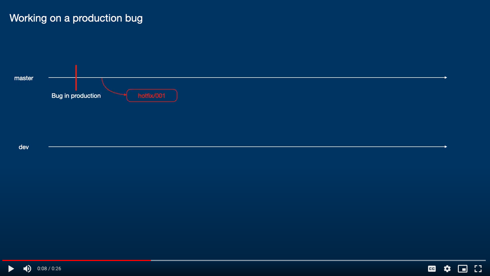

When we have a production bug to solve, we have to pay special attention to how we communicate this through the team.  
Here are the initial steps to make:

1. Double check with the project lead and QA lead whether some QA process is currently active.
    - `YES` - agree with team members when can you start working on hotfix and then proceed to step 2.
    - `NO` - proceed to the next step please
2. Make sure that you pulled latest changes from `master/main` branch locally.
3. Create a new branch with the following naming convention `hotfix/short_bug_description`.  
    For example: `hotfix/quote_booking`  

    As soon as new branch with `hotfix/*` is detected, a build pipeline for `staging` environment will start and deploy the content of that branch to `staging` environment.
4. Fixing the bug and making a commit to `hotfix` branch. On each new commit to `hotfix` branch, new deployment to `staging` environment occurs.
5. Create a pull request from `hotfix` branch to `development` branch.
6. Is there anything to fix in the pull request:
    - `YES` - alright, make the fixes on the `hotfix` branch and update the pull request.
    - `NO` - awesome, lets continue.
7. Tag the latest commit on `hotfix` branch with next version number. Do you need help with versioning? Check how we do versioning of our product [here]().
8. Once the merge from `hotfix` to `master/main` is completed, merge the `master/main` to `development` and delete the `hotfix` branch.

